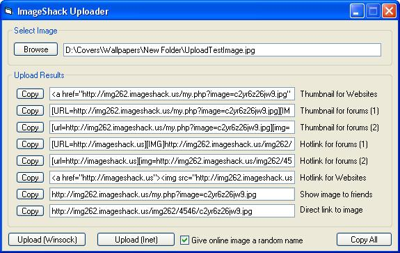



## Upload images to ImageShack with Inet and Winsock

### Description

With this module you can easily create the Header and Body to upload an image to ImageShack.us and extract the returned 'Thumbnail' and 'Hotlink' links. This example only shows you how to upload one image at a time with Inet and Winsock. If you want to upload multiple images at once, then you'll have to create a Winsock array yourself.
 
### More Info
 

             |
---                |---
**Submitted On**   |2008-01-08 19:30:24
**By**             |[Chris Donovan](https://github.com/Planet-Source-Code/PSCIndex/blob/master/ByAuthor/chris-donovan.md)
**Level**          |Intermediate
**User Rating**    |5.0 (15 globes from 3 users)
**Compatibility**  |VB 6\.0
**Category**       |[Internet/ HTML](https://github.com/Planet-Source-Code/PSCIndex/blob/master/ByCategory/internet-html__1-34.md)
**World**          |[Visual Basic](https://github.com/Planet-Source-Code/PSCIndex/blob/master/ByWorld/visual-basic.md)
**Archive File**   |[Upload\_ima214609362009\.zip](https://github.com/Planet-Source-Code/chris-donovan-upload-images-to-imageshack-with-inet-and-winsock__1-69883/archive/master.zip)

